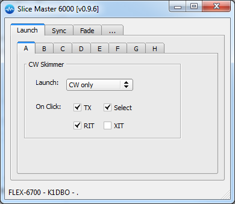
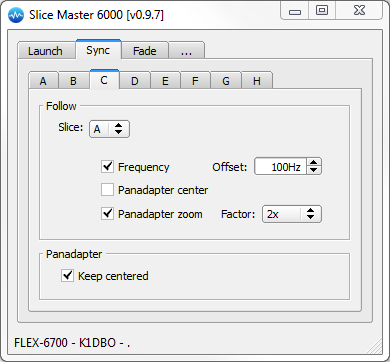
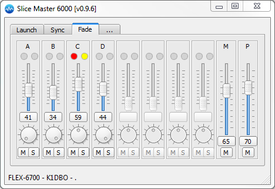
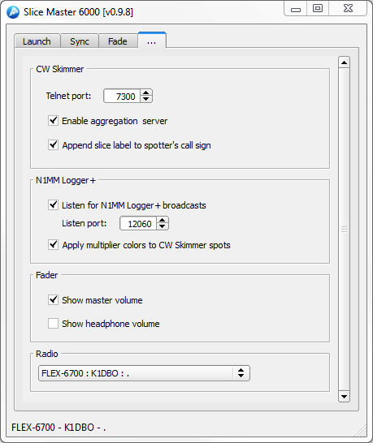

# Slice Master 6000
### version 0.9.9
### Donald Beaudry (K1DBO)

------------------------------------------ 

#### Take control of your Flex 6000 series radio's slice receivers with Slice Master 6000.

# Features
#### Simplifies CW Skimmer configuration
#### Colors CW Skimmer spots with N1MM Logger+ multipliers
#### Launches CW Skimmer automatically depending on mode
#### Aggregates CW Skimmer spots into a single telnet connection
#### Synchronizes slice and panadapter attributes between slices
#### Provides audio fader panel with solo, mute, and presets

Slice Master 6000's primary focus is on dynamically configuring and
launching CW Skimmer to work with the slice receivers in your radio.
A CW Skimmer instance can be launched for any active slice so long as
its panadapter is assoicated with a DAX IQ channel.  Clicking on a
signal in the CW Skimmer window will cause the associated slice
receiver to change frequency.  Likewise, changing the frequency of a
slice receiver will cause the associated CW Skimmer to follow along.

Slice Master 6000 is not just for CW.  It's powerful slice and
panadapter syncronziation features, and it's convienient audio fader
panel make it useful in any mode.

# Getting Started

Download the latest release from

https://github.com/K1DBO/slice-master-6000/releases 

and open the zip file.  The executable is all you'll need and doesn't
require a formal installation.  You can run it from anywhere.  Windows
is likely to ask you to allow a firewall exception so Slice Master can
estabilish a network connection with CW Skimmer and with your radio.

It is important to have already installed and configured CW
Skimmer. When Slice Master needs to create a new CW Skimmer instance
it will start with the default configuration.  If something goes wrong
with the configuration process, you can remove the newly created
config files.  They should be found in

C:\Users\<your-user-name>\AppData\Local\K1DBO 

and named Slice-A though Slice-H.

# Configuration

Once running Slice Master will present you with a collection of tabs
to control various aspects of your slices.  

## Launch

The Launch tab lets you decide when/if a CW Skimmer will be launched
for each of the slices.  If set to 'CW only', anytime the slice is
switched into CW mode, a skimmer will be configured for the slice and
launched.  If set to 'When active', this will happen any time the
slice is in use.  The 'On Click' options are useful when operating
split and control what happens when you click on a signal in CW
Skimmer.  'On Click' can be set to TX, active, or both.  

You can also choose to use XIT/RIT when clicking close to the current
signal.  This will let you "listen around" while keeping your TX
frequency fixed or "xmit around" while keeping your RX frequency
fixed.  When either option is selected and CW Skimmer is clicked
within 500hz of the slice frequency, the XIT or RIT offset will be
adjusted.  Click outside of this range to reset XIT/RIT to zero.

## Sync

The Sync tab lets you choose how slices interact with each other.
Each slice supports a "follow" option.  This option is used to make
the frequency of one slice follow the frequency of another slice.  So,
if slice B is set to follow slice A, anytime slice A changes
frequency, slice B will follow with a change of frequency.  If you
would like slice A and slice B to always have the same frequency,
you'll have to tell slice A to follow slice B and slice B to follow
slice A.  Otherwise, moving slice B will not cause slice A to move.
If you would like slice B to follow close to slice A but not match it
exactly, you can specify a value in the offset field.

Selecting 'Panadapter Center' will cause the center frequency of a
slice's panadapter to change whenever the center frequency of the
followed slice's panadapter changes.

'Panadapter zoom' will cause the display bandwidth of the slice's
panadapter to follow changes to the displayed bandwidth of the
followed slice.  A scaling factor can be applied to by setting the
factor option.

Selecting 'Keep centered' will cause the slice's panadapter to be
recentered under the slice frequency.

## Fade

The Fade tab gives you a convenient place to control the audio
settings of all your slices.  The vertical slider will adjust the
audio gain, while the knob adjusts the pan.  The button between them
shows the current audio gain and can be activated to reset that to 50.
The 'M' button will mute the slice while the 'S', solo, button mute
all other slices.

If you hold the shift key while clicking on the gain reset button,
instead of returning the gain to the preset value of 50, the preset
value will be changed.  So the next time you activate the button the
gain will return to this value.

## Settings

The Settings tab lets you control the less slice specific aspects of
Slice Master.  

When a CW Skimmer instance is launched, it needs to use a network
(telnet) port to communicate with Slice Master.  The 'Telnet port'
option specifies where to start allocating these ports.  The 'Telnet
port' itself will be used by the aggregation server while the CW
Skimmer instance associated with slice A will use the first port
number after that. Each slice after A will use the next higher port
number.  With the default port number of 7300, a Flex 6300 will use
ports 7300 through 7302 while a Flex 6700 will use ports 7300 through
7308.

Enable the aggregation server if you would like a logging program or
cluster telnet client to receive the spots found by CW Skimmer.  Your
logging program or telnet client should connect to the aggregation
server on the 'Start port'.  This eliminates the need to restart or
reconfigure your telnet client each time a CW Skimmer starts or stops.

If 'Append slice label' is checked the slice label will be appended to
the callsign that CW Skimmer uses when posting the spot.  This can be
helpful, when using two skimmers on the same band but with different
antennas.  If, instead, you're passing the spots to an upstream
cluster node, you might consider leaving this option disabled.

N1MM Logger+ users can broadcast their multipliers to Slice Master.
Slice Master's default is to listen on N1MM's default broadcast port
12060. You'll just need to enable the broadcasts in the N1MM Logger+
Configurer dialog.

The Fader section of the settings tab lets you control the visibilty
of the master volume control and the headphone volume control.  Note
that when operating with "REMOTE" selected in SmartSDR, the master
volume control is does not function.  This is a limitation of SmartSDR.

# Trouble Shooting

On occasion, CW Skimmer will not start properly and display an "access
violation" dialog.  When this happens, you can shut down CW Skimmer by
selecting the tab for the slice and choosing 'never' as the launch
option.  Then, try restarting by selecting 'CW only' or 'When active'.

If a CW Skimmer instance doesnt appear when you think it should,
verify that the slice receiver is active (visible somewhere in
SmartSDR) and set to CW mode if 'CW only' was selected as the launch
option.  Also make sure that the panadapter containing the slice has a
DAX IQ channel selected.  When attempting to restart CW Skimmer, as
described above, keep an eye on Slice Master's status line.  Many
start up errors are reported there.

Sometimes you really do need to reboot everything.  If everything
seems to be working correctly but CW Skimmer launches with the wrong
'Signal I/O Device' in it's settings, first try restarting DAX.  But
if that doesnt fix it, reboot.  

