# Slice Master 6000
### version 0.11.0
### Donald Beaudry (K1DBO)

------------------------------------------ 

#### Take control of your Flex 6000 series radio's slice receivers with Slice Master 6000.


# Features
#### Configures and launches multiple third party applications automatically
+ CW Skimmer, GRITTY, DM780, WSJT-X, flDigi, JTDX, JS8Call, MSHV, MMTTY

#### Aggregates spots for display in SSDR panafalls
+ spot data collected from CW Skimmer, GRITTY, WSJT-X, JTDX, JS8Call, MSHV, N1MM Logger+,
  telnet clusters, CCuser, SpotCollector, HRD Logbook, and Logger32

#### Aggregates collected spots into a single telnet connection

#### Overlays bandmap onto pop-out panafalls

#### Colors spots with N1MM Logger+ multipliers, or "needed status" from
+ SpotCollector, HRD Logbook, Logger32

#### Supports per slice and TX following HRD TCP client connections

#### Supports per slice and TX following CAT over TCP client connections

#### Synchronizes slice and panadapter attributes between slices
+ zoom, scale, center, frequency

#### Provides audio mixer panel 
+ solo, mute, agc, sidetone, monitor, and level presets

------------------------------------------ 

#
# Introduction

Slice Master 6000's primary focus is on dynamically configuring and
launching third party programs to work with the slice receivers in
your radio.  A program instance can be launched for any active slice
so long as its panadapter is assoicated with the necessary resources.
Two way communication between Slice Master 6000 and the programs it
launches is maintained.  Clicking on a signal in CW Skimmer, for
example, will cause the associated slice receiver to change frequency.
Likewise, changing the frequency of a slice receiver will cause the
associated CW Skimmer to follow along.

Slice Master 6000 is not just for managing other third party programs.
Its powerful slice and panadapter synchronization features, and its
convienient audio mixer panel make it useful when used alone.  Even
when Slice Master 6000 does not control the third party program, its
HRD TCP listener provides Flex specific functionality to HRD clients
that cannot be found anywhere else.

The Slice Master 6000 bandmap can display spot data inside of a Smart
SDR panafall.  The spot data comes from many sources.  Internally
launched applications have their spot data aggregrated and presented
to external loggers via the built-in telnet aggregration server. This
data is also available for display in the bandmap.  The Slice Master
6000 bandmap can also be configured to aquire spot data from external
sources.  Telnet cluster, N1MM Logger+, and DXLab's Spot Collector are
all supported.


# Getting Started

The current version of this README can be viewed at

```
    https://github.com/K1DBO/slice-master-6000
```

and the latest release can be downloaded from

```
    https://github.com/K1DBO/slice-master-6000/releases
```

Download, open the zip file, and extract the contents to a convienient
place.  The executable is all you'll need and doesn't require a formal
installation or escalated privileges to run or install.  You can run
Slice Master 6000 from any folder.  Windows is likely to ask you to
allow a firewall exception so Slice Master 6000 can estabilish network
connections with your third party programs and your radio.

Third party programs should be run at least once outside of Slice
Master 6000.  Their configurations dont have to be fully functional
but should include all "station information" needed by the program.
Slice Master 6000 will take care of the rest of the configuration for
you.  When Slice Master 6000 configures a new instance of a third
party program it will start with the program's default configuration
and adjust from there.  Having your "station information" in the
default configuration means you wont have to re-enter it each time
Slice Master 6000 makes a new copy.


# Configuration

Once running, Slice Master 6000 will present you with a collection of
tabs to control various aspects of your slices.

## Launch

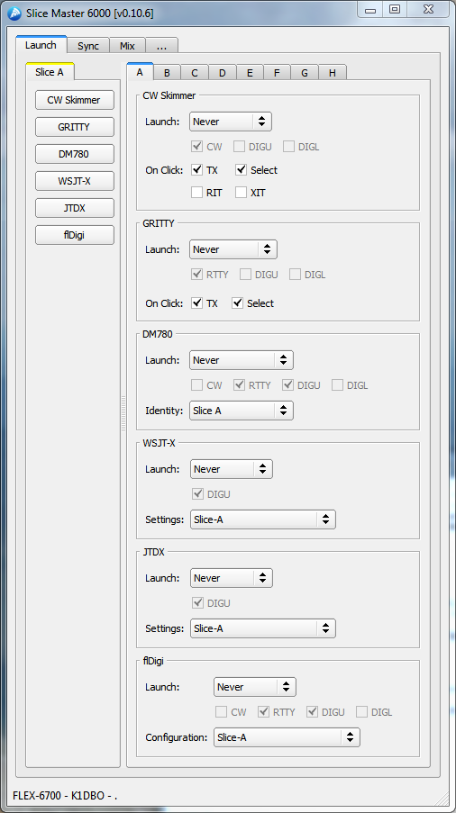

A primary goal of Slice Master 6000 is to configure and launch third
party applications to work with your Flex Signature series radio.  In
all cases, multiple instances of these programs are supported and can
be run on any or all slices at the same time.  When Slice Master 6000
launches a program for you, it take care of selecting the rig type and
audio devices.  You only need to make sure that your slice in SmartSDR
is set correctly for the application.  This usually means selecting an
appropriate mode and chosing a DAX device.  If something doesnt look
right, Slice Master 6000 will display a helpful message in its
status area.

The Launch tab lets you decide when/if a third party application will
be launched for each of the slices.  The launch option can be set to
'Never', 'When active' or 'By mode'.  If set to 'When active', anytime
the slice is active in SmartSDR, Slice Master 6000 will launch an
instance of the application configured to work with the current slice
settings.  If set to 'By mode', anytime the slice is active and
switched into one of the selected modes, Slice Master 6000 will launch
a properly configured instance of the application.

The column of buttons to the left of the launch settings are "quick
launch" buttons.  Selecting a quick launch button instantly sets the
launch option for the application to "When active".  This in turn
will cause the application start.  

Dont worry if your list of applications doesnt match what you see
here.  Slice Master 6000 will not present launch options for programs
that are not installed on your computer.  But this also means that
Slice Master will not display launch options for programs that it
cannot find.  If you have any of these programs in a non-default
folder, you'll have to edit Slice Master 6000's config.ini file.


### CW Skimmer

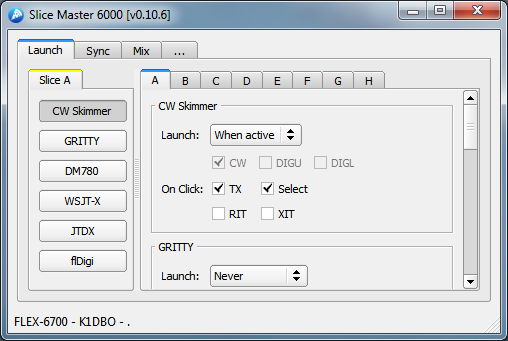

Slice Master 6000 can configure and launch CW Skimmer for you.  With
the exeception of adjusting personal preferences, there's no need to
even open CW Skimmer's settings dialog.  Slice Master 6000 has already
set the radio type and audio device options for you.  Note that CW
Skimmer uses a DAXIQ channel, not a DAX audio channel.  The DAXIQ
channel is set in the SmartSDR panafall options.

CW Skimmer, has multiple 'On Click' options.  They are used to control
what happens when a click is made inside the CW Skimmer window. At any
given time in SmartSDR there is an active slice.  This is the slice
with the yellow triangle and frequency marker.  If the 'Select' option
is chosen here, whenever a click is made inside the CW Skimmer window,
the slice associated with that CW Skimmer instance will become the
active slice.  Likewise, choosing the 'TX' option will cause
SmartSDR's TX slice to change.  Regardless of these options, a click
inside of CW Skimmer's window will change the slice frequency to match.

Slice Master 6000 can also control your XIT and RIT settings as 'On
Click' options.  When clicking inside CW Skimmer close to (within
500hz) the current signal, instead of moving the operating frequency,
Slice Master will adjust either the RIT or XIT to the newly specified
offset.  This will let you "listen around" while keeping your TX
frequency fixed or "xmit around" while keeping your RX frequency
fixed.  Click outside of this "close" range to reset XIT/RIT to zero.

CW Skimmer serves as a source of spot data for Slice Master 6000's
bandmap and telnet aggregration server.

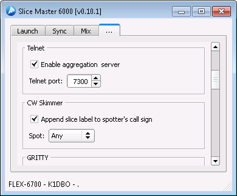

The spots generated by CW Skimmer are sent to the internal
aggregration server and then to any clients connected to the server.
Connecting clients directly to a CW Skimmer instance's telnet server
is discouraged.

Often it's usful to know which CW Skimmer instance spotted a signal.
This is great for anyone comparing antennas with a dual SCU radio.
When enabled, the option to 'Append slice label to spotter's call sign
will append a slash followed by the slice letter to the callsign used
in the spot.  Normally, this is your own callsign and might appear as
K1DBO/A if the CW Skimmer was running on slice A.

Minimal spot filtering is available too.  Choose between 'Any', 'CQ or
DE', and 'CQ only' to specify which spots will be send to the bandmap
aggregration server.


### GRITTY

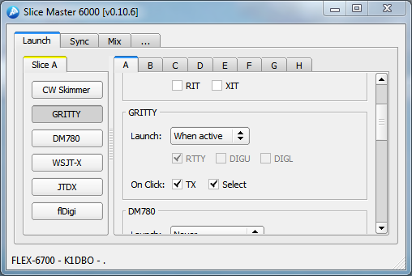

GRITTY, has two 'On Click' options.  They are used to control what
happens when a click is made inside the GRITTY window.  If the
'Select' option is chosen, whenever a click is made inside the GRITTY
window, the slice associated with that GRITTY instance will become the
active slice in SmartSDR.  Likewise, choosing the 'TX' option will
cause SmartSDR's TX slice to change to the associated slice.

For GRITTY to launch, the slice must have a DAX audio channel selected
and that channel must be enabled in the SmartSDR DAX Control Panel.

The settings panel for GRITTY

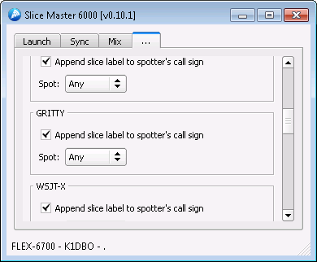

is very similar to the settings panel for CW Skimmer.  


### Ham Radio Deluxe's DM780

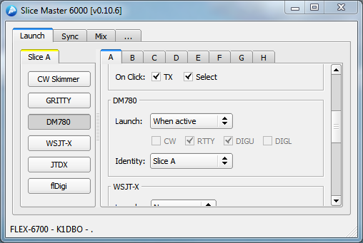

DM780 can be launched automatically depending on mode or whenever a
slice is active.  If you are currently using DM780 identities to
manage different configurations the 'Identity' option will be familar.
If not, you might consider learning about the feature. In short, a
DM780 identity will remember your screen layout, radio layout, and
operating mode.  Having a seperate one for each or similar digimodes
will minimize the amount mode specific manual reconfiguration you'll
need to do each time Slice Master 6000 launches DM780.

New Identities can be created from DM780's File/Identities Menu.  All
new identities are available for use from Slice Master 6000.  Note,
however, that the identity must be selected manually from DM780 at
least one for it to finish creating it.  Slice Master will not be able
to configure an Identity that has not be selected manually at least
once.

For DM780 to launch, the slice must have a DAX audio channel selected
and that channel must be enabled in the SmartSDR DAX Control Panel.


### WSJT-X 


WSJT-X supports multiple settings folders.  To run multiple instances
of WSJT-X, it's necessary to choose a different settings folder for
each instance.  By default, Slice Master 6000 provides a settings
folder for each slice. But, creating new ones is easy enough if you
have the need.  Select the &lt;new&gt; settings from the drop down menu and
change the name to anything you like.  Be sure to press the enter key
when you are done naming your new settings folder.

Note that WSJT-X also provides a feature known as 'Configurations'.  A
Configuration, in this context, is complete set of settings that exist
inside the Settings folder where your instance in running.  Dont
confuse settings and configurations.  

Aside from personal preferences and changing operating modes, you
should not need to adjust the settings in the WSJT-X setting dialog.
If you do take a look there, you might be surprised to find that the
Rig has been set to 'Ham Radio Deluxe'.  This is the correct setting.
The Network Server specified belongs to Slice Master.  There is no
need to change these settings.

For WSJT-X to launch, the slice must have a DAX audio channel selected
and that channel must be enabled in the SmartSDR DAX Control Panel.


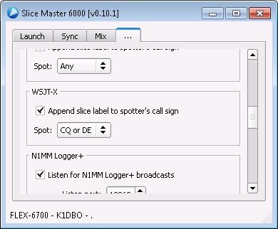

Since WSJT-X is also a source of spot data, its settings panel
provides the 'Append slice label to spotter's call sign' option as
well as basic spot filtering.  See the section on CW Skimmer for a
more detailed description of these options.


### JTDX

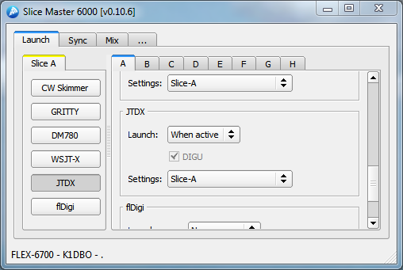

JTDX supports multiple settings folders.  To run multiple instances
of JTDX, it's necessary to choose a different settings folder for
each instance.  By default, Slice Master 6000 provides a settings
folder for each slice. But, creating new ones is easy enough if you
have the need.  Select the &lt;new&gt; settings from the drop down menu and
change the name to anything you like.  Be sure to press the enter key
when you are done naming your new settings folder.

Aside from personal preferences and changing operating modes, you
should not need to adjust the settings in the JTDX setting dialog.
If you do take a look there, you might be surprised to find that the
Rig has been set to 'Ham Radio Deluxe'.  This is the correct setting.
The Network Server specified belongs to Slice Master.  There is no
need to change these settings.

For JTDX to launch, the slice must have a DAX audio channel selected
and that channel must be enabled in the SmartSDR DAX Control Panel.

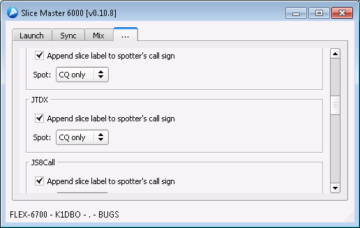

Since JTDX is also a source of spot data, its settings panel
provides the 'Append slice label to spotter's call sign' option as
well as basic spot filtering.  See the section on CW Skimmer for a
more detailed description of these options.

### MSHV

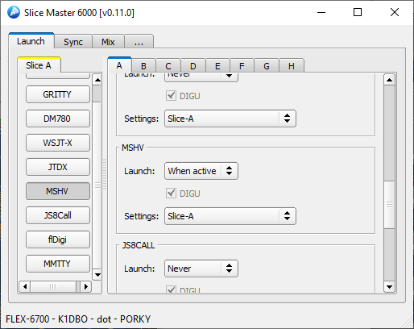

MSHV supports multiple settings folders.  To run multiple instances
of MSHV, it's necessary to choose a different settings folder for
each instance.  By default, Slice Master 6000 provides a settings
folder for each slice. But, creating new ones is easy enough if you
have the need.  Select the &lt;new&gt; settings from the drop down menu and
change the name to anything you like.  Be sure to press the enter key
when you are done naming your new settings folder.

Aside from personal preferences and changing operating modes, you
should not need to adjust the settings in the MSHV setting dialog.
If you do take a look there, you might be surprised to find that the
Rig has been set to 'Ham Radio Deluxe'.  This is the correct setting.
The Network Server specified belongs to Slice Master.  There is no
need to change these settings.

For MSHV to launch, the slice must have a DAX audio channel selected
and that channel must be enabled in the SmartSDR DAX Control Panel.

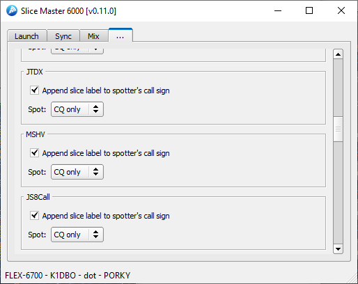

Since MSHV is also a source of spot data, its settings panel
provides the 'Append slice label to spotter's call sign' option as
well as basic spot filtering.  See the section on CW Skimmer for a
more detailed description of these options.

### JS8Call

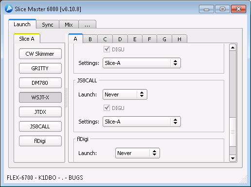

JS8Call supports multiple settings folders.  To run multiple instances
of JS8Call, it's necessary to choose a different settings folder for
each instance.  By default, Slice Master 6000 provices a settings
folder for each slice. But, creating new ones is easy enough if you
have the need.  Select the &lt;new&gt; settings from the drop down menu and
change the name to anything you like.  Be sure to press the enter key
when you are done naming your new settings folder.

Aside from personal preferences and changing operating modes, you
should not need to adjust the settings in the JS8Call setting dialog.
If you do take a look there, you might be surprised to find that the
Rig has been set to 'Ham Radio Deluxe'.  This is the correct setting.
The Network Server specified belongs to Slice Master.  There is no
need to change these settings.

For JS8Call to launch, the slice must have a DAX audio channel selected
and that channel must be enabled in the SmartSDR DAX Control Panel.

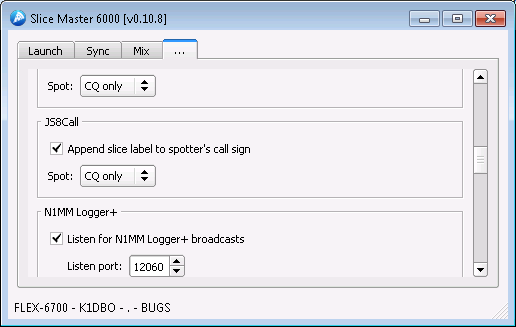

Since JS8Call is also a source of spot data, its settings panel
provides the 'Append slice label to spotter's call sign' option as
well as basic spot filtering.  See the section on CW Skimmer for a
more detailed description of these options.

### FlDigi

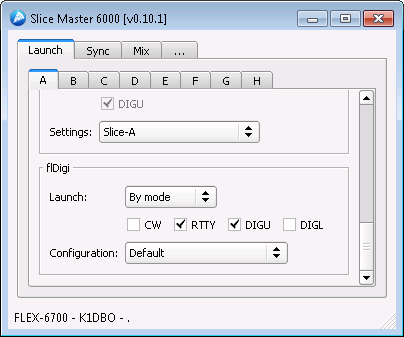

FlDigi supports multiple instances and these instances can share
configurations.  Feel free to use the default configuration or create
a new one for each mode.  To create a new configuration, select the
&lt;new&gt; option from the configuration drop down menu.  Then, enter a
name for the new configuration and press enter.  

For DM780 to launch, the slice must have a DAX audio channel selected
and that channel must be enabled in the SmartSDR DAX Control Panel.


## Sync

The Sync tab lets you choose how slices interact with each other and
other programs.


### Follow

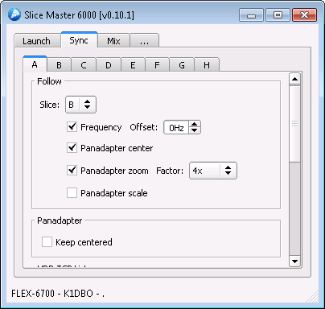

Each slice supports a "follow" option.  This option is used to make
the frequency of one slice follow the frequency of another slice.  So,
if slice B is set to follow slice A, anytime slice A changes
frequency, slice B will follow with a change of frequency.  If you
would like slice A and slice B to always have the same frequency,
you'll have to tell slice A to follow slice B and slice B to follow
slice A.  Otherwise, moving slice B will not cause slice A to move.
If you would like slice B to follow close to slice A but not match it
exactly, you can specify a value in the offset field.

Selecting 'Panadapter Center' will cause the center frequency of a
slice's panadapter to change whenever the center frequency of the
followed slice's panadapter changes.

'Panadapter zoom' will cause the display bandwidth of the slice's
panadapter to follow changes to the displayed bandwidth of the
followed slice.  A scaling factor can be applied to by setting the
factor option.

'Panadapter scale' will cause the vertical scale of slice's panadapter
to follow the vertical scale of the followed slice.

Selecting 'Keep centered' will cause the slice's panadapter to be
recentered under the slice frequency.

### HRD TCP Listener

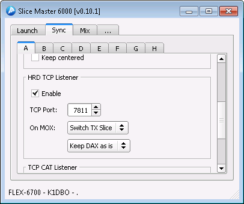

Ham Radio Deluxe defines a TCP protocol for passing radio control
information to clients like DM780 or HRD Logbook.  Check the enable
box in the HRD TCP Listener group and there's no need to run the Rig
Control component of Ham Radio Deluxe.  Instead, clients can connect
to any slice though Slice Master 6000's HRD TCP Listener.  A seperate
listener is provided for each slice.  

The 'On MOX' settings gives you control over how the slice will act
when the connected program engages the transmitter.  When working with
digimode programs it's important to insure that the DAX function is
enabled.  Setting this option to 'Toggle DAX On' will ensure DAX is
enabled when needed but not disrupt the state of other slices.
Likewise, choosing 'Toggle TX Slice' will cause the slice to be the
active TX slice only when transmit is requested.  Once the
transmission ends, TX will return to its previous slice.

On the settings tab 

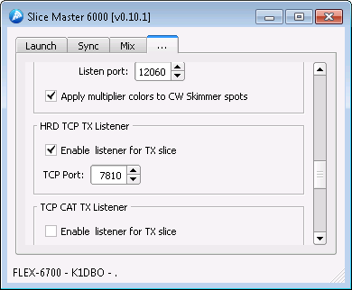

you'll also find an HRD TCP Listener panel to enable a listener that
follows the TX slice. You must specify the port number for Slice
Master to listen on and then configure the program you'd like to
follow you your TX slice to use that port number when connecting to
Slice Master 6000.

If you have ever wished HRD Logbook would support more that once
slice, this might be the feature you've been looking for.


### TCP CAT Listener

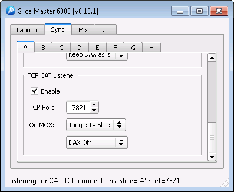

The TCP CAT Listener is similar to SmartSDR CAT's TCP support. It is
known to work with hamlib's Flex 6xxx rig definition.

The 'On MOX' settings gives you control over how the slice will act
when the connected program engages the transmitter.  When working with
digimode programs it's important to insure that the DAX function is
enabled.  Setting this option to 'Toggle DAX On' will ensure DAX is
enabled when needed but not disrupt the state of other slices.
Likewise, choosing 'Toggle TX Slice' will cause the slice to be the
active TX slice only when transmit is requested.  Once the
transmission ends, TX will return to its previous slice.

On the settings tab, there are options for a TCP CAT TX Listener


that will follow the TX slice.  You must specify the port number for
Slice Master to listen on and then configure the program you'd like to
follow you your TX slice to use that port number when connecting to
Slice Master 6000.


## Mix

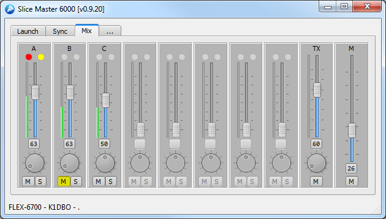

The Mix tab gives you a convenient place to control the audio output
settings of all your slices.  The vertical slider will adjust the
audio gain, while the knob adjusts the pan.  The button between them
shows the current audio gain and can be activated to reset the gain
and pan to their preset values.  The 'M', mute, button will mute the
slice while the 'S', solo, button mutes all other slices.

If you hold the &lt;shift&gt; key while selecting the gain preset button,
instead of returning the gain and pan to their preset values, the
current values will be saved as the presets.  So the next time you
select the button, the gain and pan will be restored to these saved
values.

The solo button can also be used to form a solo group. When holding
the &lt;Ctrl&gt; key while selecting the 'S' button, the slice will be added
to the solo group.  This is an easy way to mute everything except the
selected slices.

The Mixer section of the settings page allows the mixer to be
customized.  If you'd like to hide inactive slices or enable AGC
adjustments, select the corresponding options there.

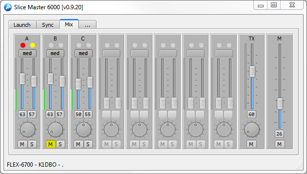

With AGC controls enabled each slice will have two sliders.  One for
the audio gain and another for the AGC threshold.  A button for the
AGC mode is also provided.  The AGC preset button works like the
preset button for the audio gain except it affects only the AGC
threshold and AGC mode.

## Settings

The Settings tab lets you control the less slice specific aspects of
Slice Master 6000.  

### Bandmap

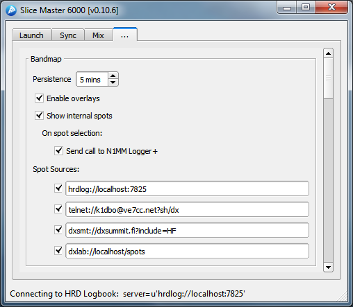

The bandmap panel controls the visibilty of the bandmap as well as its
content.  With the 'Enable Overlays' option selected, Slice Master
6000 will watch for pop-out panafall windows belonging to Smart SDR.
When it finds one, it will attach a menu bar to the title bar of the
panafall and start displaying spots on top of the panafall.  The items
in the title bar contol what happens when spot is selected on the
panafall.

The term "internal spots" refer to spots generated by the programs
that Slice Master 6000 has launched.  Sometimes not displaying these
spots works out better.  If, for example, one of your external Spot
Sources connects to Slice Master 6000's telnet server then filters and
returns the spots to Slice Master, disabeling the display of internal
spots might be useful.

#### Spot sources

Slice Master 6000 supports three different kinds of spot data sources.
The programs that Slice Master 6000 knows how to manage and can
produce spot data are one kind.  Telnet clusters are the second, and
specialized adapters to third party logging programs are the third.

Internally launched programs have their own settings to control which
spots are sent to the aggregation server.  For telnet clusters, enter
the URI for your favorite cluster.  Follow this pattern to construct
the URI:

```
    telnet://<callsign>:<password>@<host>:<port>?<initial command>
```

The angle bracket denote the different fields.  Only the &lt;host&gt; is
required, though the &lt;port&gt; is often needed too.

So, telnet://XXXX@ve7cc.net will get you started (replace XXXX with
your call sign.  I also use telnet://k1dbo@daphne:7301?sh/dx
to connect to a CC User instance running on a near by computer.

If you use DXLabs SpotCollector, give

```
    dxlab://localhost/spots
```

a try.  The colors used in the bandmap are defined in Spot Collector.
If Spot Collector is not running on the local computer, you must
enable its web server.

DX Summit provides spots though a web interface.  Slice Master can
read this web interface to populate the bandmap. Use

```
    dxsmt://dxsummit.fi
```

filter parameters can also be passed much like on the web.  Use your
browser to build a filter then cut and paste the URL into one of Slice
Master's spot sources.  Replace the 'http' with 'dxsmt' and enable
source.

Simple Parks on the Air spot source.

```
    pota://api.pota.app
```

no additional options are supported.

If you are an HRD Logbook user, you'll get even more data about your
spots by specifying

```
    hrdlog://localhost
```

HRD Logbook is a bit different from the others.  It doesnt supply
spots.  Instead, however, it will "color" the spots from other sources
both internal and external.  If the spot shows up in the bandmap with
green text, it's a new country.  If red, it's a new country for the
band. And, if blue, it's a new QSO for the band.  Gray text will let
you know you've already worked that callsign on the current band.

Note that you dont need to add telnet connections to your CW Skimmers
if they are launched by Slice Master 6000.


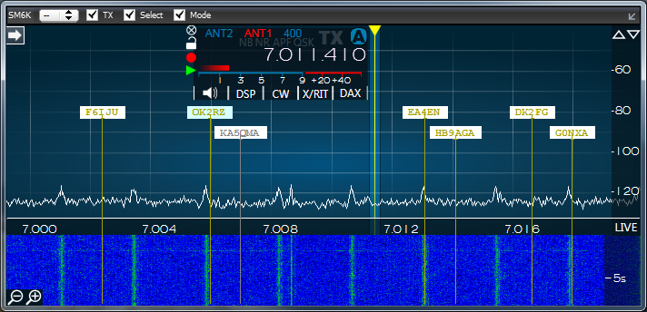

Double clicking on a spot in the bandmap will move a slice to that
spot.  But first, a slice must be chosen.  By default, the chosen
slice is the active slice. In SmartSDR, it's the one decorated with
the yellow triangle.  In the bandmap menu, the active slice is marked
with an '@'. But you can choose any slice to control, even the TX
slice or a slice in a different panafall.

The check boxes in the bandmap menu bar will determine what happens
when you double click a spot.  A single click will simply display
additional information about the spot.

The SM6K label can be thought of as a handle on the bandmap overlay.
It's useful to know this in case the bandmap becomes disassociated
with the panafall or becomes associated with the wrong panafall.  If
you notice things are odd, you have two choices.  Either disable then
enable the overlays, or just grab the lost SM6K label and drag it on
top of the panafall.  Slice Master will then re-associate them.  Note
this hardly every happens but contesters might be interested in the
quickest way to get back in sync.

The combo box will let you choose which slice will be affected when a
spot from that band map is double-clicked.  The slices are labeled as
expected A-H.  So if you choose A then double-click a spot, slice A
will change frequency to the frequency of the spot.  If the "TX" check
box is checked, slice A will also become the TX slice.  If the
"Select" check box is checked, slice A will also become the selected
slice (yellow triangle in SSDR).  If the "Mode" check box is checked,
the mode of slice A will be changed to the mode indicated by the spot.

There are two special entries in the slice selection combo-box: '@'
and 'TX'.  When '@' is the chosen slice, the actions I described above
will affect the slice that is currently selected in SSDR.  Likewise,
when 'TX' is the chosen slice, the actions described above will affect
SSDR's TX slice.

In case you need to get them out of the way, the small round button on
the right side of the menubar will hide and show the spots.

Note that overlaying a window on top of another is tricky business.
You should expect to see some minor issues.


### Telnet

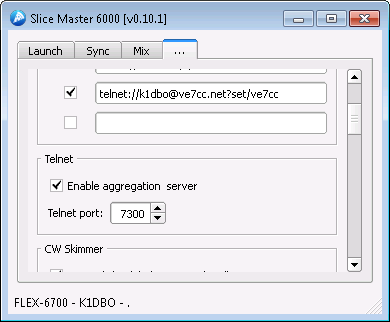

Enable the telnet aggregation server if you would like a logging
program or cluster telnet client to receive the spots found by CW
Skimmer or other Slice Master 6000 managed sources.  Your logging
program or telnet client should connect to the aggregation server on
the 'Telnet port'.  This eliminates the need to restart or reconfigure
your telnet client each time a CW Skimmer starts or stops.  It also
allows access to spots that are not normally available through a
telnet connection, like those from WSJT-X.


### N1MM Logger+


N1MM Logger+ users can broadcast their multipliers to Slice Master
6000.  Slice Master 6000's default is to listen on N1MM's default
broadcast port 12060. You'll just need to enable the broadcasts in the
N1MM Logger+ Configurer dialog.  See the N1MM Logger+ documentation
for more information.

Note that option will accept packets from any program that sends
packets in N1MM+ broadcast format.  Logger32 is not only capable of
sending N1MM+ style broadcast packets, it also includes additional
color information.

Slice Master 6000 can also keep your active slice or TX slice in sync with
with the "focus" radio in N1MM+.  


### Mixer
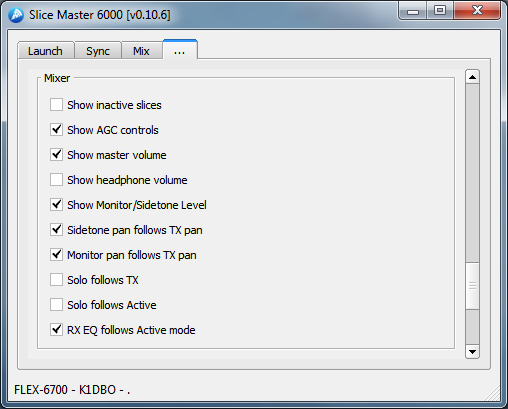

The Mixer section of the settings tab lets you control the visibilty
of the master volume control and the headphone volume control.  Note
that when operating with "REMOTE" audio selected in SmartSDR, the
master volume control does not function.  This is a limitation of
SmartSDR as it hands over control to the local computer. Controls for
inactive slices can be hidden and additional controls adjusting AGC
parameters and be enabled.

The Mixer is also able to dynamically adjust to your operating
settings.  If you are only interesting hearing the audio from either
(or both) the selected slice and the TX slice, checking the
corresponding 'solo' option will enable the feature.  


### Status Broadcast
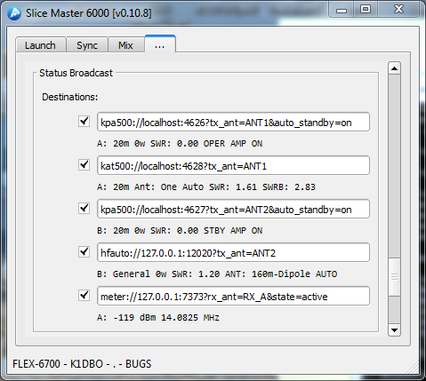

The Status Broadcast section of the settings tab provides a means to
broadcast information to other programs or services.  Similar to spot
sources, these broadcasts are specified with a URI

```
    <protocol>://<login>:<password>@<host>:<port>?<conditions>
```

Generally speaking, the <protocol> specifies the format of the
broadcast message and thus its intended target.  Unlike the <host> and
<port>, components of the URL, the <login> and <password> are rarely
needed.  The <conditions> tend to specify the what and when of the
broadcasts.

The following protocols:
- kpa500
- kat500
- hfauto
- radioinfo, and
- meter

and the following conditions:
- state = TX, ACTIVE
- tx_ant = ANT1, ANT2, XVTR
- rx_ant = ANT1, ANT2, RX_A, RX_B, XVTR
- slice =  A, B, C, D, E, F, G, H, ACTIVE, TX
- band = 160m, 80m, 40m, 30m, 20m, 17m, 15m, 12m, 10m, 6m, 2m

are supported.

If multiple commands are specified they must be seperated with an ampersand and conditions must be met.  If
multiple values for a command are specified, only one value must match.


#### kpa500://
The kpa500 protocol is designed to work with Elecraft's KPA500 Remote
Program.  Note that this is not the same as Elecraft's KPA500 Utility.  

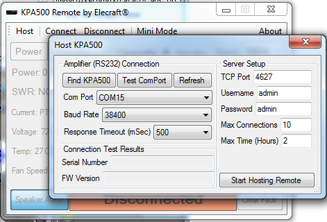

The port, username, and password in the broadcast URI must all match
the settings in the KPA500 Remote Program and, of course, the remote
program must be running.

Two conditions of interest are supported:
    - tx_ant=<antenna>
and
    - auto_standby=on

The 'tx_ant' command lets you specify which Flex antenna port is
conencted to your KPA500.  Whenever a slice is set to transmit on that
antenna port, Slice Master 6000 will insure that the KPA500 is set to the
correct band for that slice.

If the 'auto_standby' condition is set, Slice Master 6000 will automatically
switch the KPA500 between Operate and Standby modes depending on
whether the desiginated tx_ant is the currently active TX antenna.

#### kat500:// 
The kat500 protocol is designed to work with Elecraft's KAT500 Remote
Program.  Note that is not the same as the KAT500 Utility.

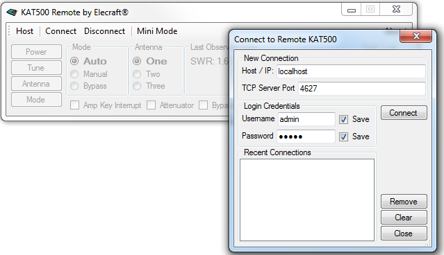


The port, username, and password in the broadcast URI must all match
the settings in the KAT500 Remote Program and, of course, the remote
program must be running.

As with the kpa500 protocol, the 'tx_ant' command is used to associate
the broadcasts with the antenna port conneted to the KAT 500.  Note
that the Elecraft KAT500 Remote Program does not accept band or
frequency data over its network connection.  So this protocol is
"status only" for now.

#### hfauto://
The hfauto protocol is designed to work with the HF-Auto
App from W1TR Software.

Username and password are not used.  If your HF-Auto App remote
network control configuration has not been modified, port 12020 should
work.  The HF-Auto App provides many options for remote control
through network broadcasts.  Please read the documentation included
with the HF-Auto App for complete details.

Set the 'tx_ant' condition to the antenna port used by your
HF-Auto. The HF-Auto will then receive advanced notice of frequency
changes and in most cases will already be tuned to the correct
frequency before you transmit.

#### radioinfo://
The radioinfo protocol implements the radioinfo packets defined by
N1MM+.  Many other programs can use these packets to stay informed
about the current state of your Flex slices.

#### meter://


### Operator
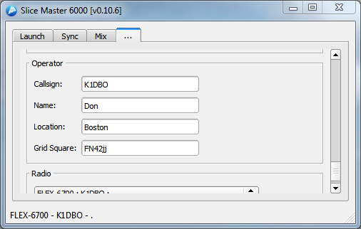

The Operator section of the settings tab lets you describe the
personal side of your station.  Many third party applications require
this information.  If you provide it here, Slice Master 6000 will set
it for you in the configurations of the programs it launches.

### Radio
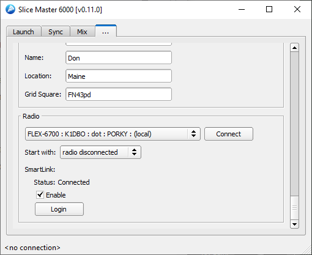

The Radio section is used to select the radio you would like to use with Slice Master.  Available radios will appear in the list to the left of the Connect button.  Once a selection has been made the Connect button is used to establish the connection.

Slice Master will also check these options at start up to determine if an automatic connection should be made.  By default, Slice Master will Start with the first radio it discovers.  Optionally, it will start with the last radio to have been connected, or no connection at all.

If you would like to choose a SmartLink accessible radio and havent logged into the Smartlink server, press the Login button to show the SmartLink Loging dialog box.

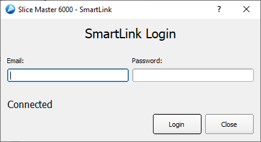

Enter your SmartLink credentials and press the Login button.  When your credentials are accepted, the status will change from 'Authorization needed' to 'Connected'.


# Start Up Options

When starting Slice Master 6000 from a cmd window or a shortcut
options can be specified to customize behavior.  For normal operation
options are usually not needed.  When they are, specifying them once
will is all that is necessary.  Except for the log options, the
configuration changes requested by the options are persistent.

```
  --log-level LOG_LEVEL [LOG_LEVEL ...]
  	 additional logging options

  --log-preset PRESET   
  	 select a logging preset from the config file

  --window-width WIDTH  
  	 width in pixels of main window

  --window-height HEIGHT
  	 height in pixels of main window

  --window-x X
         x position of main window

  --window-y Y
         y position of main window

  --window-minimized BOOL
         start main window minimized

  --bandmap-text-scale SCALE
         scale factor (percent) for callsigns in the bandmap
         overlay

  --bandmap-persistence MINUTES
         spot will be removed from the bandmap after MINUTES
         from the last update

  --bandmap-stick-color COLOR
         change the COLOR of the stick for all spots

  --bandmap-max-sources MAX
         maximum number of spot source (10 or fewer)

  --fix-truncated-win10-audio-device-names BOOL
         fix truncated audio device names on Win10

  --skimmer-launch-delay DELAY
         time in seconds to wait between launching CW Skimmer
         instances

  --skimmer-connect-delay DELAY
         time in seconds to wait before connecting to a CW
         Skimmer instance

  --radio-filter FILTER
         FILTER is a string to choose among multiple radios
         at start up.  Like filter.txt.

  --radio RADIO
         IP Address of the radio to connect to.  For
         use on a routed VPN only.

  --station STATION
  	 Name of Multi-Flex station to bind to.
```

# Trouble Shooting

On occasion, CW Skimmer will not start properly and display an "access
violation" dialog.  When this happens, you can shut down CW Skimmer by
selecting the tab for the slice and choosing 'never' as the launch
option.  Then, try restarting by selecting 'CW only' or 'When active'.

If a CW Skimmer instance doesnt appear when you think it should,
verify that the slice receiver is active (visible somewhere in
SmartSDR) and set to CW mode if 'CW only' was selected as the launch
option.  Also make sure that the panadapter containing the slice has a
DAXIQ channel selected.  When attempting to restart CW Skimmer, as
described above, keep an eye on Slice Master 6000's status line.  Many
start up errors are reported there.

If Slice Master 6000 dies an unexpected death it might not clean up
after itself and leave some third party programs running.  If this
happens, it or the third party programs, might have trouble stating
again.  Killing these programs either from their menus or from the
task manager can often help.  This can even apply to programs that
have launched other programs.  OmniRig is sometimes the culprit.

Sometimes you really do need to reboot everything.  If everything
seems to be working correctly but CW Skimmer launches with the wrong
'Signal I/O Device' in its settings, first try restarting the DAX
Control Panel.  But if that doesnt fix it, reboot.

## &lt;no connection&gt;

If Slice Master 6000 cannot connect to your radio, it's probably a
firewall configuration issue.  The first time you run Slice Master
6000, Windows will ask you to grant Slice Master permission to use
your network.  If you decline, Slice Master wont be able to connect to
your radio.

Slice Master does not yet support Flex's Smart Link protocol.  This
means that the computer runnning Slice Master and your radio have to
be on the same network.  If they are not on the same network, Slice
Master will display the &lt;no connection&gt; message.

## Missing features

Slice Master 6000 populates its list of Launch options by looking at
your computer to see which supported programs are installed.  If you
have installed a supported program anywhere other than its default
install location, Slice Master 6000 will not be able to find it and
will not show the launch options for it.

You can fix this problem by manually editing Slice Master 6000's
`config.ini` to indicate the actual location of the supported program.
The config.ini file is located in

```
    C:\Users\<your user name>\AppData\Local\K1DBO\slice-master
```

Notepad or any other plain text editor should work find.  

# Support

Bug reports are both welcome and encouraged.  Please send all reports
to SliceMaster@K1DBO.com.  To get a bit ahead of the game please make
sure you have the latest version of Slice Master 6000 from 

```
    https://github.com/K1DBO/slice-master-6000/releases 
```

and reboot both your computer and your radio then confirm the problem
still exists.  Sending a zip file of your Slice Master log files along
with the report can save time.  Just navigate to

```
    C:\Users\<your user name>\AppData\Local\K1DBO
```

then right-click on slice-master and select 'Send to\Compressed
(zipped) folder'.  This will create a zip file that you can then
attach to your email.


