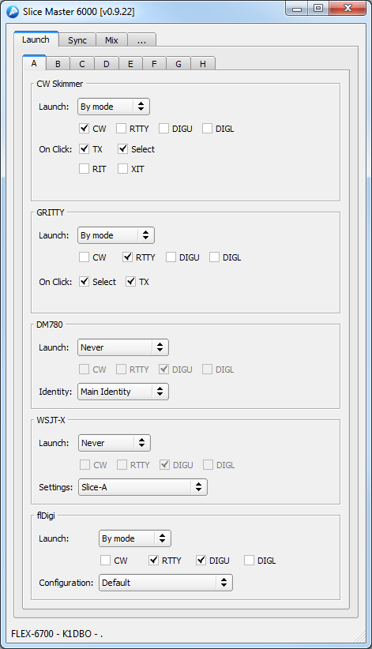
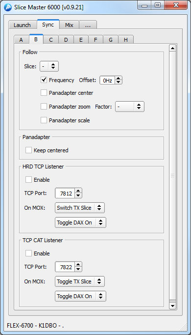
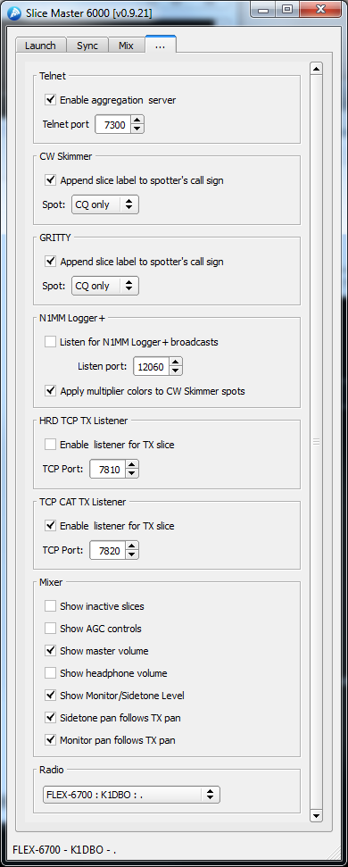

# Slice Master 6000
### version 0.9.22
### Donald Beaudry (K1DBO)

------------------------------------------ 

#### Take control of your Flex 6000 series radio's slice receivers with Slice Master 6000.

# Features
#### Automatically configures and launches multiple third party applications
##### CW Skimmer, GRITTY, DM780, WSJT-X, flDigi
#### Colors CW Skimmer spots with N1MM Logger+ multipliers
#### Aggregates CW Skimmer and GRITTY spots into a single telnet connection
#### Supports per slice and TX following HRD TCP client connections
#### Supports per slice and TX following CAT over TCP client connections
#### Synchronizes slice and panadapter attributes between slices
##### zoom, scale, center, frequency
#### Provides audio mixer panel 
##### solo, mute, agc, sidetone, monitor, and level presets

Slice Master 6000's primary focus is on dynamically configuring and
launching other third party programs to work with the slice receivers
in your radio.  A program instance can be launched for any active
slice so long as its panadapter is assoicated with the necessary
resources.  Two way communication between Slice Master and the
programs it launches is maintained.  Clicking on a signal in the CW
Skimmer window, for example, will cause the associated slice receiver
to change frequency.  Likewise, changing the frequency of a slice
receiver will cause the associated CW Skimmer to follow along.

Slice Master 6000 is not just for managing other third party programs.
Its powerful slice and panadapter synchronization features, and its
convienient audio mixer panel make it useful when used alone.  Even
when Slice Master does not control the third party program, it's HRD
TCP listener provides Flex specific functionality to HRD clients that
cannot be found anywhere else.

# Getting Started

Download the latest release from

https://github.com/K1DBO/slice-master-6000/releases 

and open the zip file.  The executable is all you'll need and doesn't
require a formal installation.  You can run it from anywhere.  Windows
is likely to ask you to allow a firewall exception so Slice Master can
estabilish a network connection with CW Skimmer and with your radio.

Third party programs need to be installed first and should be run at
least once outside of Slice Master.  The configurations dont have to
be fully functional but should include all "station information"
needed by the program.  Slice Master will take care of the rest of the
configuration for you.  When Slice Master needs to create a new
instance of a third party program it will start with the programs
default configuration.  Having your "station information" in the
default configuration means you wont have to re-enter it each time
Slice Master makes a new copy.

# Configuration

Once running Slice Master will present you with a collection of tabs
to control various aspects of your slices.  

## Launch

The Launch tab lets you decide when/if a third party application will
be launched for each of the slices.  The launch option can be set to
'Never', 'When active' or 'By mode'.  If set to 'When active', anytime
the slice is active in SmartSDR, Slice Master will launch an instance
of the application configured to work with the current slice settings.

If set to 'By mode', anytime the slice is active and switched into one
of the selected modes, Slice Master will launch an properly configured
instance of the application.

Different application allow other options to be set here too.  CW
Skimmer, has 'On Click' options that are useful when operating split
and control what happens when you click on a signal in CW Skimmer.
'On Click' can be set to TX, active, or both.

You can also choose to use XIT/RIT when clicking close to the current
signal.  This will let you "listen around" while keeping your TX
frequency fixed or "xmit around" while keeping your RX frequency
fixed.  When either option is selected and CW Skimmer is clicked
within 500hz of the slice frequency, the XIT or RIT offset will be
adjusted.  Click outside of this range to reset XIT/RIT to zero.

Similar launch features are available for GRITTY as well.  XIT/RIT
support is available.

Like the others, DM780 can be launched automatically depending on mode
or whenever a slice is active.  If you are currently using DM780
identities to manage different configurations the 'Identity' option
will be familar.  If not, you might consider learning about the
feature. In short, a DM780 identity will remember your screen layout,
radio layout, and operating mode.  Having a seperate one for each or
similar digimodes will minimize the amount of manual reconfiguration
you'll need to do each time Slice Master launches DM780 for you.

In order to run multiple instances of WSJT-X, it's necessary to choose a
different configuration for each instance.  By default, each slice has
it's own configuration.  But, creating new configurations is easy
enough.  Select the <new> configuation from the drop down menu and
change the name to anything you like.  Be sure to press the enter key
when you are done naming your new configuration.

Like WSJT-X, Fldigi supports multiple configurations.  The controls
operate in a similar manner.

## Sync

The Sync tab lets you choose how slices interact with each other.
Each slice supports a "follow" option.  This option is used to make
the frequency of one slice follow the frequency of another slice.  So,
if slice B is set to follow slice A, anytime slice A changes
frequency, slice B will follow with a change of frequency.  If you
would like slice A and slice B to always have the same frequency,
you'll have to tell slice A to follow slice B and slice B to follow
slice A.  Otherwise, moving slice B will not cause slice A to move.
If you would like slice B to follow close to slice A but not match it
exactly, you can specify a value in the offset field.

Selecting 'Panadapter Center' will cause the center frequency of a
slice's panadapter to change whenever the center frequency of the
followed slice's panadapter changes.

'Panadapter zoom' will cause the display bandwidth of the slice's
panadapter to follow changes to the displayed bandwidth of the
followed slice.  A scaling factor can be applied to by setting the
factor option.

'Panadapter scale' will cause the vertical scale of slice's panadapter
to follow the vertical scale of the followed slice.

Selecting 'Keep centered' will cause the slice's panadapter to be
recentered under the slice frequency.

Ham Radio Deluxe defines a TCP protocol for passing radio control
information to clients like DM780 or HRD Logbook.  Check the enable
box in the HRD TCP Listener group and there's no need to run the Rig
Control component of Ham Radio Deluxe.  Instead, clients can connect
to any slice though Slice Master 6000's HRD TCP Listener.  A seperate
listener is provided for each slice.  On the settings tab you'll also
find an HRD TCP Listener group to enable a listener that follows the
TX slice.

The TCP CAT Listener is similar to SmartSDR CAT's TCP support. It is
known to work with hamlib's Flex 6xxx definition. The 'On MOX' setting
gives you control over how the slice will act when the remote requests
that the transmitter be engaged.  When working with digimode programs
it's important to insure that the DAX function is enabled.  Setting
this option to 'Toggle DAX On' will ensure DAX is enabled when needed
but not disrupt the state of other slices.  Likewise, choosing 'Toggle
TX Slice' will cause the slice to be the active TX slice only when
transmit is requested.  Once the transmission ends, TX will return to
its previous slice.

## Mix

The Mix tab gives you a convenient place to control the audio output
settings of all your slices.  The vertical slider will adjust the
audio gain, while the knob adjusts the pan.  The button between them
shows the current audio gain and can be activated to reset the gain
and pan to a preset value.  The 'M' button will mute the slice while
the 'S', solo, button mute all other slices.

If you hold the shift key while clicking on the gain preset button,
instead of returning the gain to the preset value, the preset values
will be changed to the current values.  So the next time you activate
the button, the gain and pan will be restored to the current values.

The Mix section of the settings page allows the mixer to be
customized.  If you'd like to hide inactive slices or enable AGC
adjustments, select the corresponding options there.

With AGC controls enabled each slice will have two sliders.  One for
the audio gain and another for the AGC threshold.  A button for the
AGC mode is also provided.  The AGC preset button works like the
preset button for the audio gain except it affects only the AGC
threshold and AGC mode.

## Settings

The Settings tab lets you control the less slice specific aspects of
Slice Master.  

Enable the aggregation server if you would like a logging program or
cluster telnet client to receive the spots found by CW Skimmer.  Your
logging program or telnet client should connect to the aggregation
server on the 'Telnet port'.  This eliminates the need to restart or
reconfigure your telnet client each time a CW Skimmer starts or stops.

When a CW Skimmer or GRITTY instance is launched, it needs to use a
network (telnet) port to communicate with Slice Master.  This port 
will be allocated automatically.

If 'Append slice label' is checked for CW Skimmer or GRITTY the slice
label (A-H) will be appended to the callsign that the program uses
when posting the spot.  This can be helpful, when using two skimmers
on the same band but with different antennas.  If, instead, you're
passing the spots to an upstream cluster node, you might consider
leaving this option disabled.

N1MM Logger+ users can broadcast their multipliers to Slice Master.
Slice Master's default is to listen on N1MM's default broadcast port
12060. You'll just need to enable the broadcasts in the N1MM Logger+
Configurer dialog.  See the N1MM Logger+ documentation for more
information.

The HRD TCP TX Listener can be enable to allow programs like HRD
Logbook to follow and control the TX slice.  Following the TX slice
for digimode operation doesnt work well because of the lack of DAX
audio coordination.  For HRD TCP listener suport of digimodes, take a
look at the options under the Launch tab.

The Mixer section of the settings tab lets you control the visibilty
of the master volume control and the headphone volume control.  Note
that when operating with "REMOTE" selected in SmartSDR, the master
volume control does not function.  This is a limitation of
SmartSDR. Controls for inactive slices can be hidden and additional
controls adjusting AGC parameters and be enabled.

# Trouble Shooting

On occasion, CW Skimmer will not start properly and display an "access
violation" dialog.  When this happens, you can shut down CW Skimmer by
selecting the tab for the slice and choosing 'never' as the launch
option.  Then, try restarting by selecting 'CW only' or 'When active'.

If a CW Skimmer instance doesnt appear when you think it should,
verify that the slice receiver is active (visible somewhere in
SmartSDR) and set to CW mode if 'CW only' was selected as the launch
option.  Also make sure that the panadapter containing the slice has a
DAX IQ channel selected.  When attempting to restart CW Skimmer, as
described above, keep an eye on Slice Master's status line.  Many
start up errors are reported there.

If Slice Master dies an unexpected death it might leave running
programs that it launched.  If this happens, it might have trouble
stating again.  Killing these programs either from their menus or from
the task manager can often help.  This can even apply to programs that
have launched other programs.  OmniRig is sometimes the culprit.

Sometimes you really do need to reboot everything.  If everything
seems to be working correctly but CW Skimmer launches with the wrong
'Signal I/O Device' in it's settings, first try restarting DAX.  But
if that doesnt fix it, reboot.  

